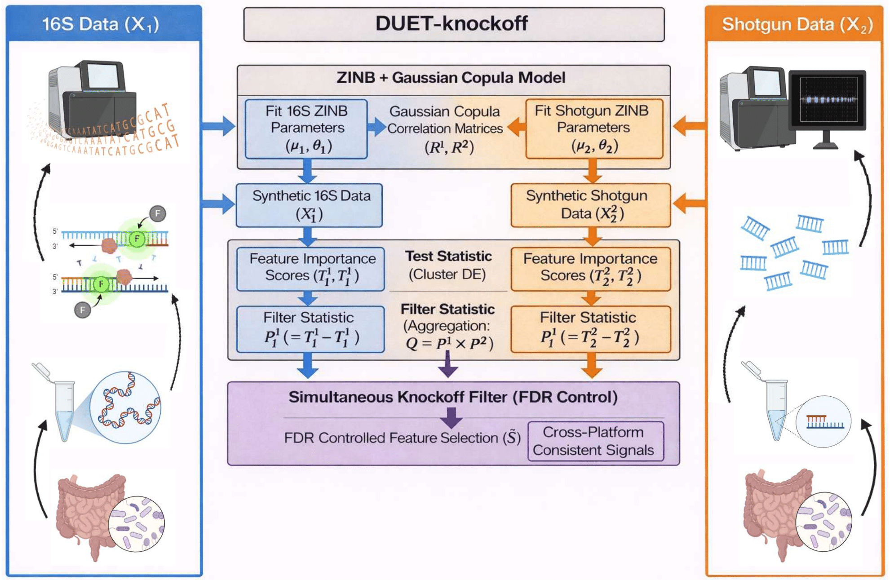

<!-- README.md is generated from README.Rmd. Please edit that file -->

```{r, include = FALSE}
knitr::opts_chunk$set(
  collapse = TRUE,
  comment = "#>",
  fig.path = "man/figures/README-",
  out.width = "100%"
)
```

# DUETknockoff

## Overview

DUET-knockoff is a knockoff-based framework for integrative feature selection from paired 16S and shotgun microbiome profiles. For each taxon, it tests a union null hypothesis that the taxon is not conditionally associated with the outcome in at least one platform. Within each platform, taxon counts are modeled using zero-inflated negative binomial (ZINB) distributions coupled with a Gaussian copula to generate knockoff statistics. Platform-specific knockoff contrasts are then combined via the simultaneous knockoff filter to obtain a single statistic per taxon, yielding finite-sample false discovery rate (FDR) control for cross-platform consistent signals.

<p align="center">
  
</p>

## Installation

``` r
# install.packages("devtools")
devtools::install_github("dyxstat/DUET-Knockoffs")
```

## Example

An example of using the DUET_knockoff function

```{r example, eval=FALSE}
library(DUETknockoff)

set.seed(42)

data("W")        # count matrix
data("M")        # library size
data("y")        # control / case group
data("data_x")   # host covariates
data("class_K")  # sequencing platforms

# Run DUET_knockoff using differential expression–based test statistic
res.DUETknockoff <- DUET_knockoff(
  W = W,
  M = M,
  class_K = class_K,
  y = y,
  data_x = data_x,
  T_var = NULL,          # causal taxa set is NULL
  test_statistic = "DE",
  filter_statistics = 1,
  fdr = 0.1,
)

# Detected genera set
genera_idx <- res.DUETknockoff$S
genera_set <- colnames(W)[genera_idx]
genera_set

# [1] "g__Actinomyces"    "g__Neisseria"      "g__Haemophilus"    "g__Prevotella"     "g__Veillonella" 
# [6] "g__Granulicatella" "g__Megasphaera"    "g__Oribacterium"   "g__Atopobium"      "g__Bulleidia"  
# [11] "g__Mogibacterium"  "g__Selenomonas"    "g__Blautia"
```

